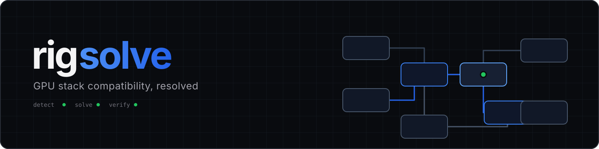

<p align="center">
  
</p>

# rigsolve

[](https://github.com/satwiksps/rigsolve/actions/workflows/ci.yml)
[](https://codecov.io/gh/satwiksps/rigsolve)
[](https://pypi.org/project/rigsolve/)
[](https://www.python.org/downloads/)
[](LICENSE)

Resolve torch, CUDA, and native extension compatibility from sourced evidence.

```console
$ rigsolve check
[FAIL] torch was built for CUDA 12.4, but flash-attn expects CUDA 11
  fix: re-resolve torch and the extension on one CUDA line
```

rigsolve detects the local GPU stack without importing torch. It resolves driver, CUDA, Python, platform, GPU architecture, torch build, C++ ABI, package coupling, and known broken combinations together.

## Install

```bash
python -m pip install rigsolve
```

Requires Python 3.10 or newer. Current target data focuses on Linux x86_64 and NVIDIA CUDA stacks.

## Quick start

Inspect the machine:

```bash
rigsolve detect
rigsolve doctor
```

Create a plan:

```bash
rigsolve solve \
  --want 'flash-attn==2.8.3' \
  --target 'RTX 4090,driver=580.65,python=3.12,linux'
```

Typical output:

```bash
# Matrix 2026.08.15 (1e066bd53f01); evidence: metadata-backed.
python -m pip install --index-url https://download.pytorch.org/whl/cu126 torch==2.9.0
python -m pip install 'https://github.com/Dao-AILab/flash-attention/releases/download/v2.8.3/flash_attn-2.8.3%2Bcu12torch2.9cxx11abiTRUE-cp312-cp312-linux_x86_64.whl#sha256=4e2f9e39313266b1544b68138b15b91ee6221eccf14f7902b7c6620351340810'
```

Install and verify on the detected machine:

```bash
rigsolve solve --want torch --execute
```

`--execute` runs isolated import checks and available GPU probes after installation. Hypothetical `--target` and `--python` plans cannot be executed.

Diagnose an installed environment:

```bash
rigsolve check
rigsolve check --fix
```

Explain a request:

```bash
rigsolve why 'flash-attn==2.8.3' \
  --target 'RTX 4090,driver=580.65,python=3.12,linux'
```

## Commands

| Command | Purpose |
|---|---|
| `rigsolve detect` | Profile the GPU, driver, toolkit, Python, platform, and installed packages |
| `rigsolve solve` | Resolve a compatible stack and render an install plan |
| `rigsolve check` | Report known problems in the installed environment |
| `rigsolve why` | Explain a solution or reduced conflict |
| `rigsolve verify` | Run isolated imports and available GPU probes |
| `rigsolve matrix` | Inspect, update, or extend compatibility facts |
| `rigsolve doctor` | Check rigsolve and NVIDIA tooling |

Plans can be rendered as pip, uv, TOML, Dockerfile, JSON, or Colab output. Only `solve --execute` installs packages.

See the [CLI reference](docs/cli.md) for all options.

## Evidence

| Label | Meaning |
|---|---|
| Metadata-backed | Published artifact or documented build axis |
| Install-tested | Exact artifact installed in a recorded environment |
| Import-tested | Package imported and available build metadata was recorded |
| GPU-tested | A minimal kernel ran on the recorded GPU architecture |

Evidence depth is not a probability. Local execution verifies the selected stack on the current machine. It does not make a global claim about other GPUs or systems.

The bundled matrix contains 114 sourced facts and one scoped `known_broken` entry for the flash-attn `2.8.3.post1` filename mismatch.

```bash
rigsolve matrix stats
```

Read the [trust model](docs/trust-model.md) and [matrix schema](docs/matrix-schema.md) before contributing evidence.

## Safety

- Detection, solving, diagnosis, and matrix inspection are offline by default.
- There is no telemetry.
- Native imports run in child processes.
- `verify --contribute` writes a local JSON file and uploads nothing.
- Matrix updates validate the complete payload before replacing the cache.
- Install plans are reviewable. Installation requires `--execute`.

## Contributing

Use [CONTRIBUTING.md](CONTRIBUTING.md) for code and matrix changes. Report new incompatibilities with the [known broken issue form](https://github.com/satwiksps/rigsolve/issues/new?template=known-broken.yml). Report security issues through [SECURITY.md](SECURITY.md).

## Social assets

- [Wide social card](site/public/social-card.png)
- [Square social card](site/public/social-card-square.png)
- [GitHub social preview](site/public/github-social-preview.jpg)
- [README banner](site/public/rigsolve-banner.svg)

## License

[Apache License 2.0](LICENSE)
