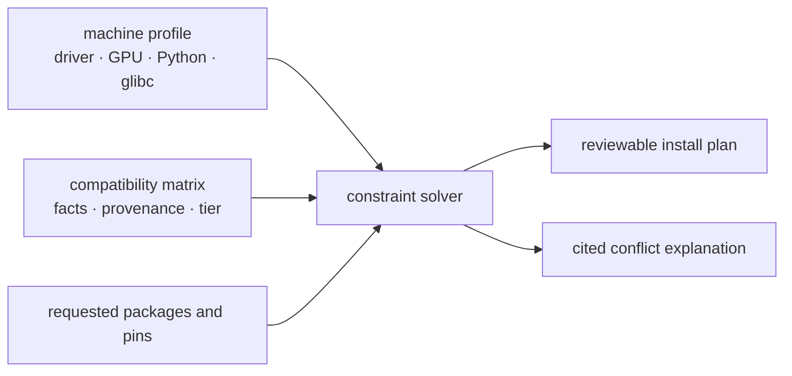

# rigsolve

[](https://github.com/satwiksps/rigsolve/actions/workflows/ci.yml)
[](https://www.python.org/downloads/)
[](https://github.com/satwiksps/rigsolve/blob/main/LICENSE)

Finds torch, CUDA, and native-extension combinations supported by sourced evidence — and explains every constraint.

```text
ImportError: libcudart.so.11.0: cannot open shared object file: No such file or directory
```

```console
$ rigsolve check
[FAIL] torch was built for CUDA 12.4, but flash-attn expects CUDA 11
  This commonly surfaces as a missing libcudart.so.11 error.
  fix: re-resolve torch and the extension on one CUDA line
```

`rigsolve` inspects a broken environment without importing torch, applies a provenance-bearing compatibility matrix, and emits an ordered repair or install plan. It does not install anything unless you add `--execute`.

> [!IMPORTANT]
> The bundled `2026.08.15` matrix contains **114 facts, all tier 0 (derived)**. It proves that upstream artifacts or documented build axes exist; it does **not** prove those combinations install, import, or run. There are currently no tier-3 claims. The matrix includes one narrowly scoped `known_broken` fact for the flash-attn `2.8.3.post1` automatic filename edge. Run `rigsolve matrix stats` to inspect the data shipped with your version.

## Why this exists

Python package resolvers understand requirements and wheel tags. GPU environments add compatibility axes that are often outside package metadata: the NVIDIA driver floor, CUDA runtime line, GPU architecture, the torch build an extension targets, C++ ABI mode, and sometimes glibc. A perfectly valid `pip install` can therefore end in a loader error, an undefined symbol, or a wheel with no kernel for the installed GPU.

`rigsolve` models those axes directly and keeps the evidence attached:



The name is literal: a *rig* is the workstation, server, container, or future target; *solve* is the constraint problem that connects it to compatible artifacts.

The [architecture guide](https://github.com/satwiksps/rigsolve/blob/main/docs/architecture.md) traces detection, matrix validation, constraint search, diagnosis, and plan emission.

## Install

`rigsolve` requires Python 3.10 or newer. The supported target data is currently focused on Linux x86_64 and NVIDIA CUDA stacks.

No PyPI distribution or GitHub release has been published yet. Until the first tagged release, install the current source from `main`:

```bash
git clone https://github.com/satwiksps/rigsolve.git
cd rigsolve
python -m pip install -e .
```

Contributors can install the quality and test tools with:

```bash
python -m pip install -e ".[dev]"
```

The source checkout is the authoritative unreleased installation path. Maintainers should follow the [release and deployment runbook](https://github.com/satwiksps/rigsolve/blob/main/docs/launch-checklist.md) before adding a tag; a tag is rejected unless it points to `main`, matches the package version, and passes the complete release gate.

## Website

The project landing site lives in [`site/`](https://github.com/satwiksps/rigsolve/tree/main/site). It uses Next.js, TypeScript, and Tailwind CSS. Run it locally with `cd site`, `npm ci`, and `npm run dev`. For Vercel, import this repository, set the project **Root Directory** to `site`, and keep the auto-detected Next.js build settings. See [`site/README.md`](https://github.com/satwiksps/rigsolve/blob/main/site/README.md) for website-specific development and deployment notes.

## Quick start

Inspect the current machine. Detection tolerates missing `nvidia-smi`, missing CUDA toolkit, and missing or broken torch installations:

```bash
rigsolve detect
rigsolve doctor
```

Ask for a plan for a real or hypothetical target:

```bash
rigsolve solve \
  --want 'flash-attn==2.8.3' \
  --target 'RTX 4090,driver=580.65,python=3.12,linux'
```

With the bundled seed, that currently emits a reviewable shell plan like this (digest line omitted because it identifies the exact data snapshot):

```bash
# Generated by rigsolve; review before running.
# WARNING: tier 0 is derived from upstream artifacts or documentation only; it does not prove install, import, or kernel execution
# WARNING: flash-attn's wheel filename does not establish GPU kernel coverage for sm_89
python -m pip install --index-url https://download.pytorch.org/whl/cu126 torch==2.9.0
python -m pip install 'https://github.com/Dao-AILab/flash-attention/releases/download/v2.8.3/flash_attn-2.8.3%2Bcu12torch2.9cxx11abiTRUE-cp312-cp312-linux_x86_64.whl#sha256=4e2f9e39313266b1544b68138b15b91ee6221eccf14f7902b7c6620351340810'
```

The output is a proposal, not a guarantee: its weakest evidence is tier 0. Review it, then run it yourself or repeat the solve with `--execute` when you intentionally want `rigsolve` to install it. Execution is limited to pip output for the detected machine; hypothetical `--target` and `--python` overrides remain plan-only.

Explain whether a set of pins can coexist:

```bash
rigsolve why 'flash-attn==2.8.3' \
  --target 'RTX 4090,driver=580.65,python=3.12,linux'
# A solution exists (weakest evidence tier 0): torch==2.9.0, flash-attn==2.8.3
```

Diagnose first and request a minimal-change repair plan second:

```bash
rigsolve check
rigsolve check --fix
```

## Commands

| Command | What it does | Mutates the environment? |
|---|---|---|
| `rigsolve detect [--json]` | Profiles GPUs, driver, toolkit, platform, Python, and discoverable installed builds | No |
| `rigsolve solve --want SPEC...` | Solves constraints and emits `pip`, `uv`, TOML, Dockerfile, JSON, or Colab output | Only with `--execute` |
| `rigsolve check [--fix]` | Reports applicable violations; `--fix` prints a repair plan | No |
| `rigsolve why SPEC...` | Explains satisfiable requests or a minimal conflicting constraint set | No |
| `rigsolve verify [--contribute]` | Runs isolated import and selected GPU smoke probes | No; contribution output stays local |
| `rigsolve matrix show\|stats` | Shows facts, citations, digest, coverage, and tier counts | No |
| `rigsolve matrix update` | Downloads, validates, and atomically caches matrix data | Writes the validated cache and, when supplied, the requested destination |
| `rigsolve matrix add FILE --destination PATH` | Validates and merges a contributed matrix | Writes the requested destination |
| `rigsolve doctor` | Checks rigsolve, matrix, platform probes, and NVIDIA command availability | No |

Use `rigsolve COMMAND --help` for every option. The complete reference is in the [CLI documentation](https://github.com/satwiksps/rigsolve/blob/main/docs/cli.md).

## The evidence model

Every matrix fact has a source, harvest date, and verification tier. The weakest fact used by a solution becomes the plan's reported tier.

| Tier | Claim | What it does **not** claim |
|---:|---|---|
| 0 — derived | An upstream artifact, build axis, or documented constraint was observed and parsed | That it installs or works |
| 1 — installs | The combination installed in an isolated environment | That imports or kernels work |
| 2 — imports | The package imported successfully; available build metadata was recorded | That a GPU kernel ran |
| 3 — runs | A recorded minimal kernel ran on the recorded GPU architecture | Portability to other architectures or environments |

Tier 3 is intentionally narrow. A result on `sm_89` is evidence for `sm_89`, not every NVIDIA GPU. See the [trust model](https://github.com/satwiksps/rigsolve/blob/main/docs/trust-model.md) and [matrix schema](https://github.com/satwiksps/rigsolve/blob/main/docs/matrix-schema.md).

The current seed mentions artifact or coupling facts for torch, torchvision, torchaudio, flash-attn, xformers, bitsandbytes, triton, vLLM, transformers, and flashinfer-python. Its audited official torch build facts record the C++ ABI values supported by the encoded release/index pairs. That list is **not** a promise of complete version, platform, or solve coverage.

## How it relates to pip, uv, and conda

| Tool | Primary job | Where rigsolve fits |
|---|---|---|
| `pip` | Install Python distributions and resolve declared requirements | `rigsolve` emits ordered pip commands, explicit wheel URLs, and PyTorch indexes |
| `uv` | Fast Python project and environment management | `rigsolve` emits a `[tool.uv]` project snippet with explicit indexes and sources |
| `conda` | Resolve packages across Python and native channels | Conda output is outside the current scope; `rigsolve` can still diagnose the installed metadata it can discover |
| `rigsolve` | Reason over GPU build axes and explain conflicts with citations | It delegates the actual package installation; it is not an environment manager |

## Privacy and safety

- Detection and diagnosis run locally. There is no telemetry.
- Package smoke tests run in child Python processes so a crashing extension does not take down the diagnostic process.
- `verify --contribute` writes `rigsolve-verification.json` locally and uploads nothing. Review the file before attaching it to an issue.
- `matrix update` is the normal command that contacts the network. It fetches the configured URL, validates the whole payload, and replaces the cache atomically.
- Harvesting is an opt-in contributor workflow and contacts GitHub, PyPI, PyTorch, and NVIDIA sources.
- Generated plans may contain third-party URLs and shell commands. Review them before running; `--execute` is explicit for this reason.

## You found the next broken combination we need

The bundled matrix starts with one `known_broken` entry: a narrowly sourced flash-attn `2.8.3.post1` filename mismatch. Real users will find the failures upstream metadata cannot reveal, and those are uniquely valuable.

If a CUDA combination cost you three hours, spend two minutes making sure it costs nobody else three hours:

1. Open a [known-broken report](https://github.com/satwiksps/rigsolve/issues/new?template=known-broken.yml).
2. Include the exact package versions and `rigsolve detect --json` output, after checking it for anything you do not want to share.
3. Include the complete error and a source or reproducible procedure.
4. If you have a fixed environment, run `rigsolve verify --contribute`, review the local JSON, and attach it.

For a matrix PR, start with the [known-broken template](https://github.com/satwiksps/rigsolve/blob/main/examples/known-broken.toml) and follow the [contribution guide](https://github.com/satwiksps/rigsolve/blob/main/CONTRIBUTING.md). Negative facts require a useful workaround and auditable provenance.

## Current scope

`rigsolve` 0.1.0 is alpha software. This repository includes the CLI, offline detector, constraint solver, matrix validation, pip/uv/TOML/Docker/JSON/Colab emitters, diagnostics, isolated verification, and source harvesters. The bundled evidence is deliberately conservative: it is Linux x86_64 and NVIDIA CUDA focused, contains no tier-3 claims, and does not provide Conda output.

The daily harvester is read-only with respect to the repository. When upstream facts change, it uploads a validated candidate matrix and deterministic diff as a short-lived workflow artifact; it never creates a branch, pull request, commit, or merge. See the [harvesting guide](https://github.com/satwiksps/rigsolve/blob/main/docs/harvesting.md).

## Contributing and governance

Bug reports, source citations, detection fixtures, matrix facts, and verification results are welcome. Start with [CONTRIBUTING.md](https://github.com/satwiksps/rigsolve/blob/main/CONTRIBUTING.md) and read the [Code of Conduct](https://github.com/satwiksps/rigsolve/blob/main/CODE_OF_CONDUCT.md).

Security issues should follow [SECURITY.md](https://github.com/satwiksps/rigsolve/blob/main/SECURITY.md), not a public compatibility report.

## License

[Apache License 2.0](https://github.com/satwiksps/rigsolve/blob/main/LICENSE)
