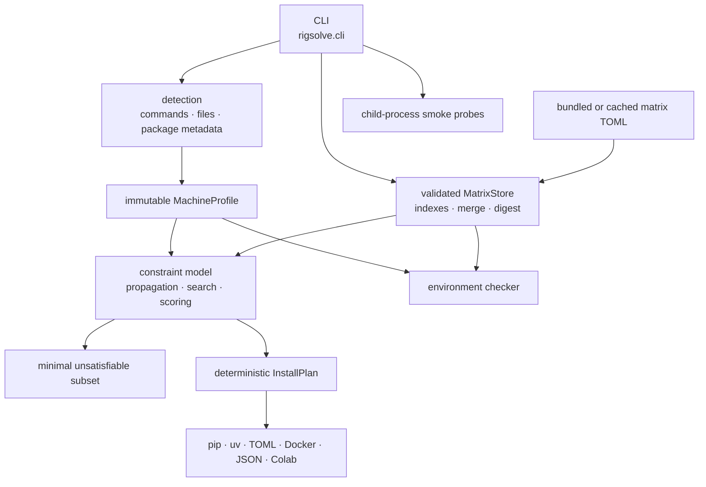

# Architecture

rigsolve is an offline-first Python CLI with four boundaries: detection, evidence, solving, and execution. Keeping those boundaries explicit lets it diagnose an environment whose native imports are already broken.

## Detection boundary

`rigsolve.detect` gathers a `MachineProfile` from commands and files rather than importing torch:

- `nvidia-smi` for GPU, compute capability, memory, and driver data;
- `nvcc --version` for an optional local toolkit;
- Python and platform APIs for OS, architecture, implementation, ABI, and glibc;
- `/proc`, cgroups, and `/.dockerenv` for WSL and container context;
- installed distribution metadata and discoverable package files for existing build markers.

Every probe is optional. Unknown data remains unknown and does not become a fabricated CPU or compatibility claim. `--target` overlays a hypothetical machine on a detected base, which makes planning for CI or a server possible without access to that GPU.

Detection commands use bounded subprocess calls. The command runner is injectable, which lets the test suite parse recorded fixtures without GPU hardware.

## Evidence boundary

`rigsolve.matrix.schema` defines frozen dataclasses for each fact family. Construction validates fields, URLs, version syntax, provenance, tiers, and family-specific invariants. `MatrixStore` adds immutable indexes and cross-fact validation.

The package ships `src/rigsolve/data/matrix.toml` for offline use. A validated cached update can be merged over it. Matrix writes use a temporary file plus atomic replacement, so an interrupted download cannot leave a partially written active cache.

The matrix digest is SHA-256 over deterministic TOML serialization. Plans and lockfiles record both version and digest; the digest identifies the exact evidence snapshot when version labels are reused during development.

See [matrix-schema.md](matrix-schema.md) for the data contract and [trust-model.md](trust-model.md) for claim semantics.

## Solver boundary

Resolution builds small domains of package candidates from wheel, torch-build, and explicitly permitted source-build facts. It then adds constraints for user pins and the applicable known dimensions, including:

- Python, platform, and glibc compatibility;
- CUDA line and NVIDIA driver floor;
- torch-to-extension build coupling;
- C++11 ABI;
- GPU architecture windows and recorded wheel architectures;
- compatible release sets;
- `known_broken` exclusions.

The core uses arc-consistency propagation, backtracking search, and minimum-remaining-values ordering. Candidate ordering is deterministic. The preference policy supplies a global score: `verified`, `newest`, `stable`, or `minimal-change`.

When no assignment exists, the solver reduces the active constraints to an irreducible conflicting subset by deletion and passes that trace to the explanation renderer. Explanations retain source citations from the facts that created constraints.

Unknown is not automatically compatible evidence. Some constraints can only be applied when their dimensions are known; output tier and warnings communicate the resulting evidence floor.

## Plan boundary

A satisfiable assignment becomes an immutable `InstallPlan` with ordered `InstallStep` values. Each step can carry an index URL, direct artifact URL, dependencies, environment variables, flags, source-build duration and RAM-per-job guidance, tier, and provenance. Source steps preserve a detected or targeted toolkit root as `CUDA_HOME`. Because the profile models GPU VRAM but not host RAM, plans with an explicit per-job RAM requirement use a deterministic single compiler job rather than inspecting mutable host resources while resolving.

Emitters are pure renderers. The same plan can become:

- reviewable pip shell commands;
- a uv project snippet;
- a deterministic TOML lockfile;
- a Dockerfile;
- JSON;
- a Colab-oriented shell bootstrap.

Rendering never installs. `execute_plan` is called only when the user explicitly supplies `--execute`. The CLI permits execution only for pip output on the detected machine; hypothetical target and Python overrides remain render-only inputs.

## Diagnosis and verification

The checker evaluates installed metadata against matrix semantics independently of the solver. It can report CUDA-line, torch-build, C++ ABI, driver-floor, architecture, release-coupling, known-broken, avoidable-source-build, and lockfile violations. `check --fix` asks the resolver for a minimal-change plan, but still only prints it.

Verification imports packages in child interpreters. A segfault or loader abort is captured as a failed probe rather than crashing the diagnostic parent. The current real GPU-kernel probes cover torch and flash-attn; other built-in probes establish at most import evidence. Contribution payload generation is a local file operation.

## Network and mutation map

| Operation | Network | Persistent write | Package install |
|---|---|---|---|
| `detect`, `why`, `check`, `doctor`, `matrix show/stats` | No | No | No |
| `solve` (default) | No | Optional lockfile | No |
| `solve --execute` | Usually, through pip/index URLs | Detected package environment and optional lockfile | Yes; pip output only |
| `verify --contribute` | No | Local reviewed JSON | No |
| `matrix update` | Yes | Validated cache/destination | No |
| Maintainer harvest script | Yes | Candidate bundled matrix or workflow artifact | No |

Normal solving can read a previously cached matrix update; it does not refresh that cache implicitly.
