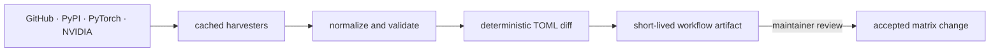

# Harvesting upstream facts

Harvesting converts upstream metadata into candidate tier-0 facts. It never promotes facts to install, import, or run evidence.

The scheduled workflow is:



There is intentionally no automated repository-write edge.

## Maintainer command

Install the project, then run the repository script:

```bash
python -m pip install -e .
python .github/scripts/harvest_matrix.py \
  --matrix src/rigsolve/data/matrix.toml \
  --cache .harvest-cache
```

The script calls the harvester APIs that exist in `rigsolve.harvest`; there is no public `rigsolve harvest` CLI command. It currently checks:

- the latest flash-attn GitHub release assets;
- the latest PyTorch release tag and its literal binary-build matrix constants;
- current PyPI release files for a conservative package list;
- NVIDIA's minor-compatibility table.

GitHub and upstream HTTP responses are ETag/Last-Modified cached. A release wheel whose embedded version disagrees with its release tag is reported and excluded from automatic positive wheel facts; that edge requires human review and may belong in `known_broken`. The script preserves an existing fact when only volatile response metadata or the harvest date changed, and it refuses to replace a keyed fact with one that drops curated fields or evidence links. A no-op run therefore does not create date-only churn. New versions are additive; removals upstream do not erase historical facts automatically.

## Scheduled review artifacts

`.github/workflows/harvest.yml` runs daily and on manual dispatch with `contents: read`. It validates the resulting matrix and runs matrix-focused tests. When the bundled file changes, the workflow uploads `matrix-candidate.toml` and `matrix-harvest.patch` as one artifact retained for 14 days. A no-op run records that result in the workflow summary and uploads nothing.

The workflow cannot push a branch, open a pull request, create a commit, or merge a change. A maintainer downloads the artifact, reviews the deterministic diff, reproduces the validation locally, and applies an accepted matrix update through the same checked process as any other repository change.

## Review checklist

Review the semantic diff, not just whether validation passed:

1. Does each source establish only the claim encoded?
2. Are package name, version, Python/ABI/platform tags, CUDA line, torch line, and C++ ABI parsed correctly?
3. Did a generic wheel accidentally acquire GPU semantics?
4. Are yanked files retained only as yanked and excluded from normal solving?
5. Are driver table changes true floor changes rather than parser drift?
6. Does the new fact broaden solver output on unsupported platforms?
7. Is every new item still tier 0?

Run:

```bash
python -m rigsolve --matrix src/rigsolve/data/matrix.toml matrix stats --json
python -m pytest tests/test_resolver.py tests/test_solver_core.py tests/test_cli.py
git diff -- src/rigsolve/data/matrix.toml
```

When an upstream layout changes, fix and test the parser separately. Do not hand-wave a parse failure by weakening schema validation.
